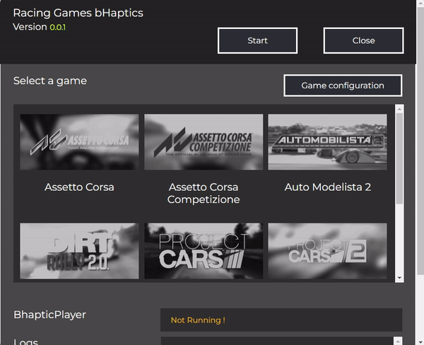
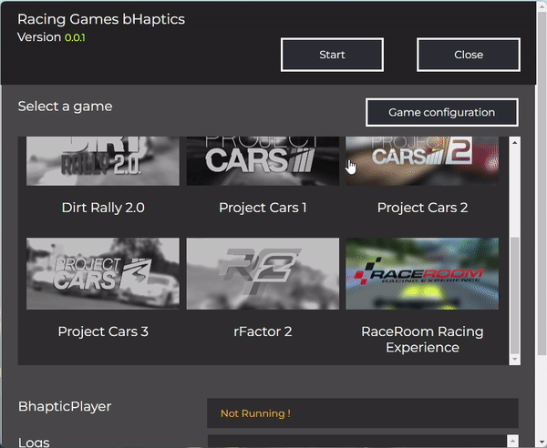

# RacingGamesBhaptics
## About the project ?

RacingGamesBhaptics is based on @NotBlue Project-Cars-Bhaptics.
It is an API based project, allowing you to use bhaptics products with many racing games on PC

☕  If you wanna show some support you can buy me a coffee : https://www.buymeacoffee.com/astienth4

## Compatibility

bHaptics devices supported:
- X40
- X16
- Arms
- Feet (Thanks to Nickbond from bHaptics discord)
- Tactvisor (Thanks to Nickbond from bHaptics discord)

## Instructions

### 1. Downloading and launching the file
Download and launch the <a href="https://github.com/Astienth/RacingGamesBhaptics/releases/download/0.0.1/racingbhaptics.Setup.0.0.1.exe">setup file</a>. 
Launch the bhaptic player. 

### 2. Launch the players
Launch Racing Game Bhaptics and Bhaptics Player.  

### 3. Check the the game-specific configurations
Depending on the game, you may have to edit the settings before the player works. Follow the instructions provided in the player. 

### 4. Launch the one of the supported  games and select the game on Racing Game Bhaptics
Launch the one of the supported games and select the game on Racing Game Bhaptics. 

### 5. Click on the Start button
Click on the start button. Wait until the player says "Running and Ready to go". 

